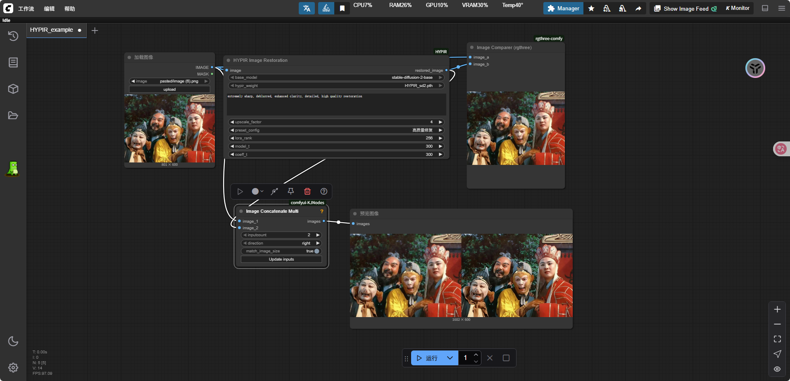

# ComfyUI-HYPIR

[English](README_EN.md) | **中文**

---

### 📖 项目简介

**ComfyUI-HYPIR** 是基于 [HYPIR项目](https://github.com/XPixelGroup/HYPIR) 开发的ComfyUI自定义节点，实现了高质量的图像修复功能。HYPIR (Harnessing Diffusion-Yielded Score Priors for Image Restoration) 是一个利用扩散模型得分先验进行图像修复的先进技术。

本节点将HYPIR的强大功能无缝集成到ComfyUI工作流中，支持：
- 🔧 **智能图像修复** - 去模糊、去噪、超分辨率
- 🎛️ **预设配置系统** - 快速修复、高质量修复、人像优化等
- 📁 **智能路径管理** - 自动检测ComfyUI模型目录，下拉菜单选择
- ⚡ **1-8倍上采样** - 灵活的分辨率提升
- 🎯 **LoRA自适应** - 自动检测和配置LoRA参数

### ✨ 主要特性

#### 🚀 **用户友好**
- **零配置启动** - 自动创建目录结构和配置文件
- **下拉菜单选择** - 无需手动输入复杂路径
- **预设配置** - 针对不同场景的优化参数
- **实时反馈** - 详细的处理状态和参数显示

#### 🔧 **技术先进**
- **ComfyUI原生集成** - 完美融入ComfyUI工作流
- **folder_paths管理** - 遵循ComfyUI标准路径管理
- **智能模型检测** - 自动发现和验证模型文件
- **内存优化** - 大图像分块处理，支持高分辨率

#### 🎨 **处理效果**
- **多场景适配** - 老照片修复、模糊图像锐化、噪点去除
- **人像优化** - 专门的人像修复预设
- **风景增强** - 针对风景照片的色彩和细节增强
- **灵活上采样** - 1-8倍分辨率提升，质量与速度平衡

### 📦 安装说明

#### 方法一：Git克隆（推荐）
```bash
cd ComfyUI/custom_nodes/
git clone https://github.com/your-repo/ComfyUI-HYPIR.git
cd ComfyUI-HYPIR
pip install -r requirements.txt
```

#### 方法二：手动下载
1. 下载项目文件到 `ComfyUI/custom_nodes/ComfyUI-HYPIR/`
2. 安装依赖：`pip install -r requirements.txt`

### 📥 模型下载

#### 必需模型文件

1. **HYPIR权重文件**
   ```bash
   # 下载到 ComfyUI/models/HYPIR/
   wget https://huggingface.co/lxq007/HYPIR/resolve/main/HYPIR_sd2.pth
   ```
   或手动下载：[HuggingFace链接](https://huggingface.co/lxq007/HYPIR/tree/main)

2. **Stable Diffusion 2.0基础模型**
   ```bash
   # 下载到 ComfyUI/models/diffusers/
   huggingface-cli download stabilityai/stable-diffusion-2-base --local-dir ComfyUI/models/diffusers/stable-diffusion-2-base
   ```

#### 🗂️ 标准目录结构
```
ComfyUI/
├── models/
│   ├── diffusers/
│   │   └── stable-diffusion-2-base/     # SD2基础模型
│   └── HYPIR/
│       └── HYPIR_sd2.pth               # HYPIR权重文件
└── custom_nodes/
    └── ComfyUI-HYPIR/                  # 本项目
```

### 🎯 使用方法

#### 1. **基础使用**
1. 重启ComfyUI
2. 在节点菜单中找到 `Image Restoration/HYPIR` → `HYPIR Image Restoration`
3. 连接图像输入
4. 选择模型（自动检测的下拉菜单）
5. 选择预设配置或自定义参数
6. 运行工作流

#### 2. **预设配置说明**
| 预设名称 | 适用场景 | 参数特点 | 推荐用途 |
|----------|----------|----------|----------|
| **快速修复** | 轻度问题 | 低参数，快速处理 | 日常照片轻微修复 |
| **标准增强** | 通用场景 | 平衡效果与速度 | 大多数修复任务 |
| **高质量修复** | 严重问题 | 高参数，质量优先 | 重要照片、严重损坏 |
| **人像优化** | 人物照片 | 针对人脸优化 | 人像、肖像照片 |
| **风景增强** | 风景照片 | 色彩和细节enhancement | 自然风光、建筑 |
| **最大效果** | 极端修复 | 最高参数设置 | 挑战性修复任务 |

#### 3. **参数调优指南**
- **upscale_factor**: 1-8倍，推荐2-4倍平衡质量与性能
- **model_t/coeff_t**: 150-300，数值越高效果越强但速度越慢
- **lora_rank**: 通常自动检测为256，无需修改
- **prompt**: 描述期望效果，如"high quality, sharp, detailed"

### 🚀 高级功能

#### 🎨 **针对性修复策略**
```
老照片修复：
- 预设：人像优化
- 提示词：vintage photo restoration, enhanced colors
- 上采样：2-3倍

严重模糊：
- 预设：最大效果  
- 提示词：extremely sharp, deblurred, enhanced clarity
- 上采样：2-4倍

低分辨率图像：
- 预设：高质量修复
- 提示词：high resolution upscale, detailed
- 上采样：4-8倍
```

#### ⚡ **性能优化**
- **GPU推荐**: NVIDIA RTX 4090/4080 (16GB+ VRAM)
- **最小要求**: GTX 1080Ti/RTX 3060 (8GB VRAM)
- **大图处理**: 自动分块，支持4K+分辨率
- **内存管理**: 智能缓存，避免重复加载

### 🔧 故障排除

#### 常见问题

**Q: 模型加载失败**
```
A: 检查文件路径：
   - HYPIR权重: ComfyUI/models/HYPIR/HYPIR_sd2.pth
   - SD2模型: ComfyUI/models/diffusers/stable-diffusion-2-base/
```

**Q: 处理效果不明显**
```
A: 调整策略：
   - 选择合适的预设配置
   - 使用针对性的提示词
   - 提高model_t/coeff_t数值
   - 增加上采样倍数
```

**Q: 显存不足**
```
A: 优化设置：
   - 降低上采样倍数
   - 使用"快速修复"预设
   - 减小输入图像尺寸
   - 关闭其他占用显存的程序
```

### 📊 效果展示

#### 🎬 **ComfyUI工作流展示**
<div align="center">
  
  <p><i>ComfyUI中的HYPIR图像修复工作流</i></p>
</div>

#### 🖼️ **修复效果对比**
<div align="center">
  
  <p><i>修复前后效果对比展示</i></p>
</div>

#### 🎯 **应用场景**
本节点在以下场景表现优异：
- ✅ **老照片修复** - 褪色、划痕、噪点去除
- ✅ **模糊图像** - 运动模糊、散焦恢复  
- ✅ **低分辨率** - 小图像高质量放大
- ✅ **噪点去除** - 高ISO噪点清理
- ✅ **细节增强** - 纹理和边缘锐化

### 🤝 致谢

本项目基于以下优秀开源项目：
- **[HYPIR](https://github.com/XPixelGroup/HYPIR)** - 核心图像修复算法
- **[ComfyUI](https://github.com/comfyanonymous/ComfyUI)** - 强大的AI工作流平台
- **[Stable Diffusion](https://huggingface.co/stabilityai/stable-diffusion-2-base)** - 基础扩散模型

特别感谢HYPIR团队的杰出工作：
> Xinqi Lin, Fanghua Yu, Jinfan Hu, Zhiyuan You, Wu Shi, Jimmy S. Ren, Jinjin Gu, Chao Dong
